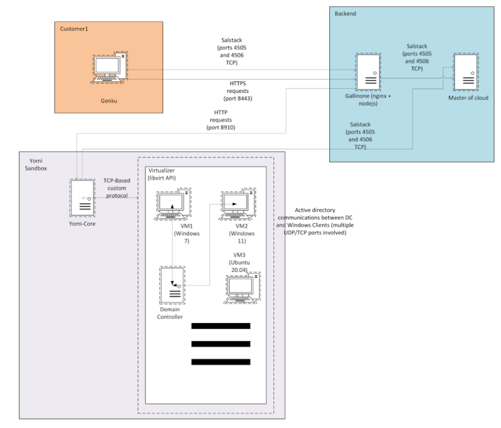

# Datasets
In this repository all datasets generated from the use case partners involved in the pilot of the Resilmesh System.

## 📊 Project Datasets

Below is a list of the datasets used for the Pilot 1 and 2 validation. You can download them directly using the links in the table:

| Dataset Name | Description | Format | Direct Download |
| :--- | :--- | :--- | :--- |
| **Alias Datasets** [👁️ More info](https://github.com/resilmesh2/Datasets?tab=readme-ov-file#alias---traffic-overview) | Normal traffic captures for IoT Domain behavioral baseline. | `ZIP` | [⬇️ Download]() |
| **ICERT Datasets** [👁️ More info](https://github.com/resilmesh2/Datasets?tab=readme-ov-file#infocert---traffic-overview) | Normal and malicious traffic captures for IT Domain behavioral baseline. | `ZIP` | [⬇️ Download](https://zenodo.org/api/records/18630966/files-archive) |
| **CARM Datasets** [👁️ More info](https://github.com/resilmesh2/Datasets?tab=readme-ov-file#carm---traffic-overview) | Normal traffic captures for Domain behavioral baseline. | `ZIP` | [⬇️ Download]() |

# InfoCert - Traffic overview
Here is described the communication flows considered normal within the infrastructure, as represented by the arrows in the architecture diagram below. These flows define the **expected behavior** of the system under regular operating conditions and serve as a baseline for detecting anomalies or malicious activity.

### Infrastructure Architecture & Data Flow

The architecture consists of three main zones: Customer1 (where our cyber monitoring probe is installed), Backend, Yomi Sandbox (Our Sandbox. This includes the Virtualization environment). The following describes the normal traffic flow between the components:

  * Customer1 <-> Backend (Gallinone)
    * Genku, representing the cyber monitoring probe installed in the customer environment, communicates directly with Gallinone via HTTPS on port 8443. This includes sending detections found by the cyber probe and so on.
    * Gallinone uses Saltstack-based communication (ports 4505 and 4506 TCP)  in order to provision the Genku probe with the needed software, as well as sending commands representing, for example, tasks the probe has to execute. Here, Gallinone is the Salt Master, and Genku is the Salt Minion.
  * Gallinone <-> Master of Cloud
    * Gallinone and Master of Cloud communicate over SaltStack, using TCP ports 4505 and 4506. Master of Cloud is the cloud provisioner, and he distributes the software executed in the backend environment. In this schema, Master of Cloud is the Salt Master, while Gallinone is the Salt Minion.
  * Master of Cloud <-> Yomi Core
    * Same as the previous point, with Master of Cloud as Salt Master and Yomi Core as Salt Minion.
  * Gallinone <-> Yomi Core
    * Gallinone sends HTTP requests on port 8910 to Yomi Core, representing the creation and status check of Sandbox submissions.  
  * Yomi Core <-> Virtualizer
    * Yomi Core communicates with the Virtualizer through the libvirt API. This traffic manages virtual machines, including turning on and off VMs, and submission of malware samples in the virtualized environment.
  * Internal Virtualizer Traffic
    * The Windows virtual machines inside the sandbox communicate with the Domain Controller, as the environment tries to replicate an Active Directory setup. Here, the Windows Server is the Domain Controller.  
  * “Human” traffic
    * In addition to everything mentioned until this point, it’s necessary to remember that, since this is a staging environment, any user with access to the company’s VPN (and enabled access) can connect via SSH to any of these machines and interact with them.
    * Another source of human-generated traffic comes from interaction with the frontend — a web application — which, in turn, generates network traffic directed toward Gallinone for processing requests and retrieving data.

It’s **important** to note that, with the exception of **point 7 (Human traffic)**, all traffic is automatically generated by the system to ensure baseline functionality. Since this is a staging environment rather than a production one, human-generated traffic is expected to be minimal, as only a limited number of people have access to it.

## Pilot 1 – InfoCert Attacks Overview

This first Pilot includes four attack scenarios, each modeled after real-world techniques and mapped to the MITRE ATT&CK framework.

---

### 1. Phishing -> Execution -> Credential Theft
A spear phishing email delivers a malicious attachment to a Windows VM. Once opened, a PowerShell script is executed, which downloads a credential dumping tool. The tool targets LSASS memory to extract user credentials from the system.  
**Key techniques:** T1566.001, T1059.001, T1003.001

---

### 2. Credential Dumping -> Lateral Movement -> Exfiltration
Starting from a compromised Linux host, the attacker searches bash history for sensitive data such as SSH credentials. These are then used to move laterally to a second host via SSH. Once inside, application logs are exfiltrated using alternative protocols (HTTP/SCP).  
**Key techniques:** T1003, T1021.004, T1048

---

### 3. Kerberoasting
From a compromised Windows VM within an Active Directory environment, the attacker uses Mimikatz to request Kerberos TGS tickets for service accounts. The encrypted tickets are then exfiltrated for offline cracking.  
**Key techniques:** T1558.003, T1048.002

---

### 4. Ransomware (Defense Evasion -> Exfiltration -> Encryption)
Simulating the final stages of the Akira ransomware campaign (as described by CISA), the attacker first disables security tools to create blind spots, then exfiltrates valuable data for double extortion purposes, and finally encrypts files on the victim machine.  
**Key techniques:** T1562.001, T1048.002, T1486

**--------------------------------------------------------------------------------------------------------------------------------**

# CARM - Traffic overview

# ALIAS - Traffic overview